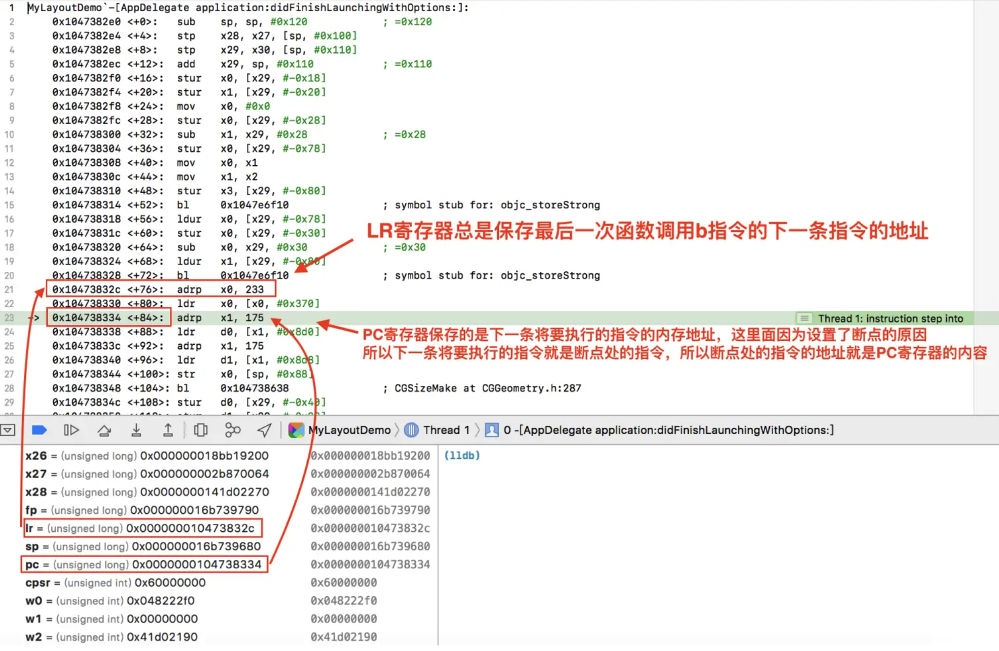

看了很多关于Crash的文章，对此如此着迷，所以就整理一下

## 寄存器

ARM一共有33个寄存器，0-30是通用寄存器，31和32是专用寄存器（31是sp寄存器，32是pc寄存器），所以是31个通用寄存器，两个特殊寄存器，当然，还有几个是状态寄存器，

前31个寄存器的访问方式是：

1. 使用X0～X30来访问时，是64位数据
2. 使用W0～W30访问时，是低32位的数据

> 注意，如果用低32位的数据访问的话，也就是W开头的，那么高位的数据就会被清空

对于特殊寄存器来说：

1. 32bit的时候，作为栈帧寄存器（stack point,SP）的时候，用WSP来访问
2. 64bit的时候，作为栈帧寄存器（stack point,SP）的时候，用SP来访问
3. 32bit的时候，作为零寄存器（Zero register）的时候，用WZR来访问
4. 64bit的时候，作为零寄存器（Zero register）的时候，用WZ来访问

每一个寄存器都干不同的事情，常用的如下

- X0～X7：传入函数的参数，如果有更多的参数，则会通过栈进行传递
- SP：上述的栈指针寄存器，维护栈指针，指向栈的顶端。
- FP（Frame Point：也就是X29，栈指针寄存器，指向栈的底部
- LR （Link Register）X30，链接寄存器，存储的是函数调用完成的返回地址，[函数的调用栈就是从LR处找到的]
  - 保存的是



[图片出处，仅用于学习，侵权会删除的](https://www.jianshu.com/p/6d7a57794122)

## objc_msgSend

OC比较特殊，所有的函数调用都会转换成objc_msgSend，对于

## 常用的LLDB命名

LLDB的一些命名，还是比较有用的，

```bash
break set -n "-[UIView layoutSubviews]" # 符号断点
break set -a 0x1029855e0 # 在某一个地址上打断点
breakpoint set --one-shot true -name '-[UILabel setText:]' // 在这个符号上打一个断点，然后one-shot,打一个就停止

po $arg1 # 打印出第一个self
po (SEL)$arg2 # 打印出当前的SEL,
expr 变量 | 表达式 # 显示变或者表达式的数值
expr -f h -- 变量 | 表达式 # 16进制格式显示变量或者表达式的数值
expr -f b -- 变量 | 表达式 # 二进制的形式
expr -i -- oc对象 #  等价于 po oc 对象
expr -P 3 -- oc对象 # 上面命令的加强版，会显示内部的数据变量的结构
expr my_struce->a = my_array[3] 赋值
expr (char*)_cmd # 显示某一个oc变量的方法名
expr (IMP)[self methodForSelector:_cmd] # 执行这个函数
p (IMP)[self methodForSelector:_cmd] # 打印出当前函数的地址
```

## 文章总结

- [深入iOS系统底层之crash解决方法 （objc_msgSend相关）](https://www.jianshu.com/p/cf0945f9c1f8)
- [深入解构objc_msgSend函数的实现](https://www.jianshu.com/p/df6629ec9a25)
- [iOS疑难Crash的寄存器赋值追踪排查技术](https://www.jianshu.com/p/958d4f109bb0)
- [货拉拉iOS疑难Crash治理-系统键盘语音](https://juejin.cn/post/7396463744186515465?searchId=20250108150822BCAC6FECA4AFF768AB6A)
- [iOS疑难Crash-_dispatch_barrier_waiter_redirect_or_wake 崩溃治理](https://juejin.cn/post/7589494074983727155)
- [iOS疑难Crash-iOS18.0+ BackBoardServices exit 崩溃治理](https://juejin.cn/post/7527224157832134696?searchId=2026010422195763B8512F21252A19E5D0)
- [司机端稳定性治理和性能优化实践, crash分析视频](https://www.bilibili.com/video/BV1re4y1G7uf/)
- [货拉拉iOS疑难Crash治理-TTS problem iOS 17](https://juejin.cn/post/7422401535214944268?searchId=2026010422195763B8512F21252A19E5D0)