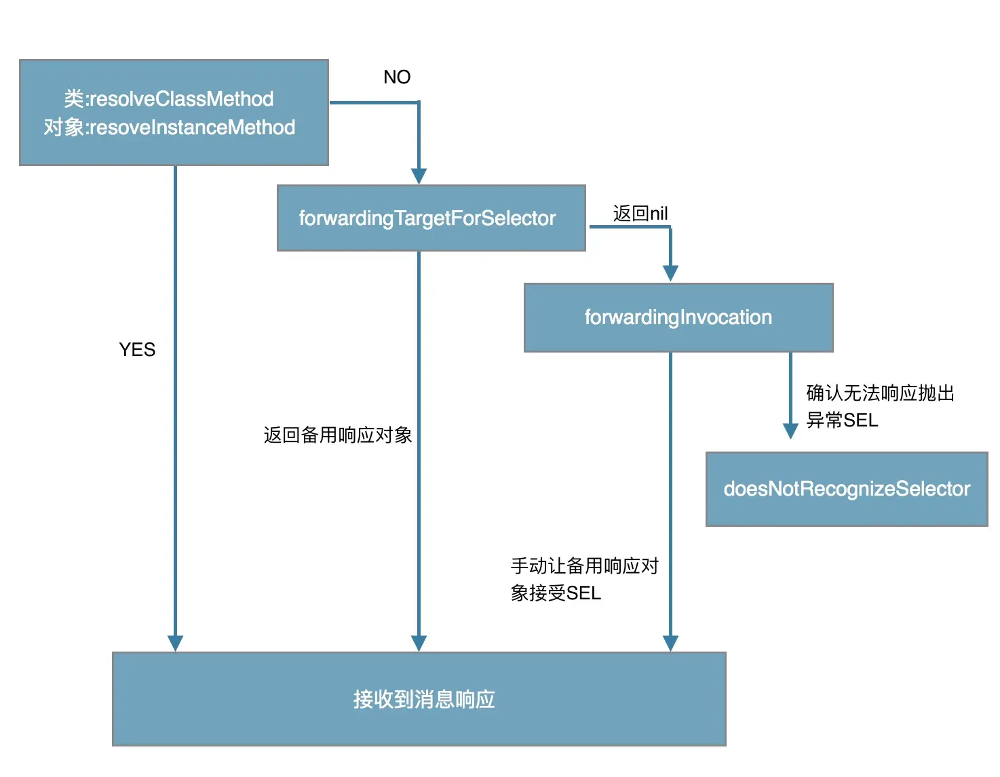

书是挺好的，但是翻译有的时候翻译真的有点烂，这里写一下我学习过程中，对例子解析一下。

## 6 了解属性的概念

这里引出OC和C++是不一样的，C++是使用offset的形式找到对应的数据变量，但是这样可能因为在不同的DLL导致起定义出错而crash，OC中将实例变量交给类对象管理，然后在运行期查找，不直接在编译期确定，可以避免上述的crash。甚至可以在运行期加入成员。

## 7 在对象内部尽量直接访问实例变量

我写代码的时候，经常有以下问题，一段代码中可以使用self.xxx或者_xxx进行访问，其中使用self.xxx可以使用懒加载，但是这里好像更推荐使用直接访问实例变量，也就是_xx这样，原因如下：

- 不会触发信息派发，那么就不会走msg_Send那一套，那么速度就会快一些
- 如果直接访问实例变量，那么就不会触发KVO（也就是键值观察）？
- 但是有时候可能使用懒加载，那么这时候可能就需要self.xxxx了，所以就有一个折中，如果是在写入的话，那么就通过设置方法self.xxx来做，如果是读取，那么就直接访问。

## 12 理解动态转发

[这篇](https://juejin.cn/post/6844903600968171533)讲得不错，其中的[代码样例](https://gist.github.com/Meteor-Z/d59cfb165345779c29dfee682dcb96c8)。

1. 先看自己能不能解决，往自己对象里面加入方法，然后再跑一遍消息转发
2. 自己不能解决，就让别的对象解决，看其他对象能不能能处理，比如说这个self的一些子类可能会处理这个self的方法
3. forwardingInvocation直接兜底，要么吃掉，要么转发其他对象，要么换成其他消息，如果怎么都不行最后直接doesNotRecognizeSelector报错。

## 17 实现description方法

顾名思义，主要是用于调试用的，在NSLog等控制台中进行调试，

- 带上对象的地址
- 带上对象的属性

> 这里有一点，NSLog如果打印一个对象的话，那么调用的就是description方法，所以如果在description方法里面调用NSLog的话，那么就会发生死递归，这里要特别注意一下。