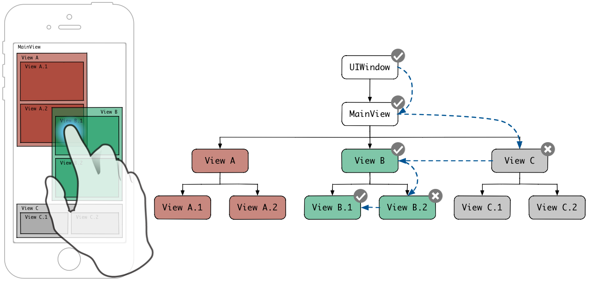

今天居然是0721诶

## 第一响应者

## 事件传递的过程

1. 触发事件后，系统会将该事件加入到一个由 UIApplication 管理的事件队列中；
2. UIApplication 会从事件队列中取出最前面的事件，将之分发出去以便处理，通常，先发送事件给应用程序的主窗口（ keyWindow ）；
3. 主窗口会在视图层次结构中找到一个最适合的视图来处理触摸事件；
4. 找到适合的视图控件后，就会调用该视图控件的 touches(_:with:) 方法；
5. touches(_:with:) 的默认实现是将事件顺着响应者链一直传递下去，直到连 UIApplication 对象也不能响应事件，则将其丢弃。

### 查找过程

iOS采用hit-test的形式进行遍历

- hit-test采用逆序深度遍历的方式找到最前面的视图，然后这个视图

## 响应者链

当事件发生之后，从触发事件的源头开始，按照一定的顺序对各个视图或者空间进行遍历处理，直到最终被处理或者被丢弃，

传递到下面后，然后往上开始回溯，找到第一个响应者，如果这个响应者不处理，就会通过nextResponder往上走，直到有事件响应。

