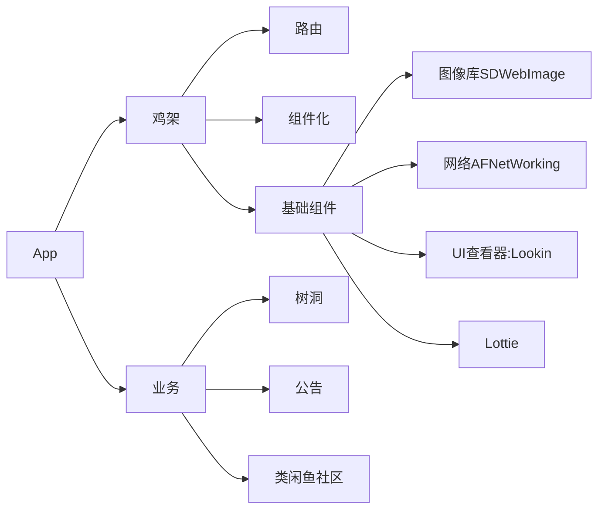

目前还在更新中，最后一次更新在 2026年9月10日

## 前期准备

### 需求背景

社招面试的时候，有一场三面，面试官问我现在VibeCoding 这么强了，有没有考虑自己做点什么事情呢，当时我的回答是AI 现在确实可以解决很多事情，但是AI 是生产端，不是消费端，我目前没有什么需求，所以没有用 AI 做什么事情，一般只在工作场景下才会 AI（或者查相关资料的场景下才会AI 一下），这句话有点余音绕梁了，目前在 AI 这么强的基础下，我能不能做一点事情呢？

同样，做东西之前，也需要需求，我想着如果能解决一些事情，是更好的，并且借此机会，能够加强一下我计算机专业能力，也是很不错的，所以就想着写一款 APP。

做 APP 肯定不是为了赚钱的目的去的，公司为了降本增效，肯定是大力推举 AI，然后快速将项目推上线，然后赚钱，但是自己做的话，其实更看重的是整个过程，如果从一个 iOS开发者的视角下，更好的设计框架、内容去完成一个 APP。并且在公司写的代码，都是基于前人搭的框架去写的，有点增删改查，这次是从0开始写一个App，并且没有PRD，没有设计，没有内容，真的是从0开始。在这一个过程中，我还是觉得自己能学到很多知识的，

我做的 APP还是有点老生常谈、有点烂俗了，但是做什么是不重要的，重要的是能够做出来，怎么实现才是重要的。目前是想做一个学校的 BBS 论坛，然后里面的内容有树洞之类的内容，并且能够发表闲置物品（只用于发表，交易还是线下交易，平台只是用于发布）。先这样写，

## 技术准备

### 客户端

因为我是做客户端的，所以这里我很熟悉，这里使用OC 语言，Xcode 编写，其实这里更应该用 flutter 这样的跨端技术，因为我一个人开发，如果要兼容Android 的话，就只能用 flutter 这样的跨端技术了，但是这里为了自己的技术，还是直接用 OC 吧。

### 后端

哎呦卧槽，我是完全不会，这里还是全部让 AI 大人帮我想吧，这里我现自己定个大致语言方向吧，使用 ----> GO!

### 设计

APP 肯定还是需要原型图的。，这里直接写个需求背景，然后直接让AI 生成一个吧。

## 整体架构

