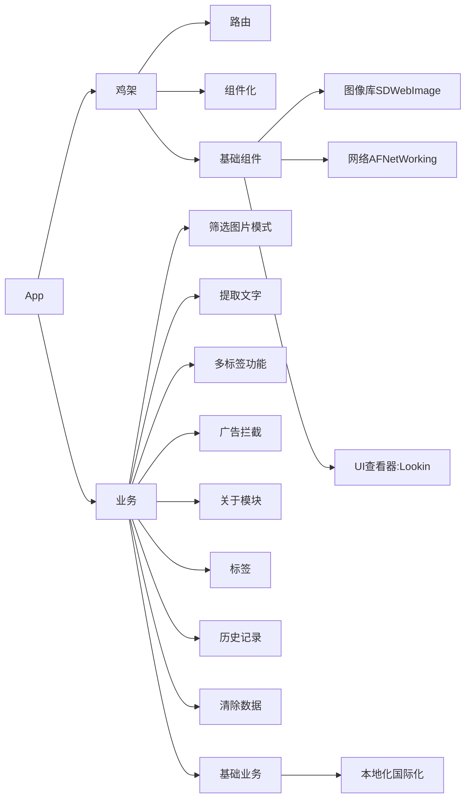

目前还在更新中....

## 前期准备

### 需求背景

社招面试的时候，有一场三面，面试官问我现在VibeCoding 这么强了，有没有考虑自己做点什么事情呢，当时我的回答是AI 现在确实可以解决很多事情，但是AI 是生产端，不是消费端，我目前没有什么需求，所以没有用 AI 做什么事情，一般只在工作场景下才会 AI（或者查相关资料的场景下才会AI 一下），这句话有点余音绕梁了，目前在 AI 这么强的基础下，我能不能做一点事情呢？

同样，做东西之前，也需要需求，我想着如果能解决一些事情，是更好的，并且借此机会，能够加强一下我计算机专业能力，也是很不错的，所以就想着写一款 APP。

做 APP 肯定不是为了赚钱的目的去的，公司为了降本增效，肯定是大力推举 AI，然后快速将项目推上线，然后赚钱，但是自己做的话，其实更看重的是整个过程，如果从一个 iOS开发者的视角下，更好的设计框架、内容去完成一个 APP。并且在公司写的代码，都是基于前人搭的框架去写的，有点增删改查，这次是从0开始写一个App，并且没有PRD，没有设计，没有内容，真的是从0开始。在这一个过程中，我还是觉得自己能学到很多知识的

我做的 APP还是有点老生常谈、有点烂俗了，但是做什么是不重要的，重要的是能够做出来，怎么实现才是重要的。~~目前是想做一个学校的 BBS 论坛，然后里面的内容有树洞之类的内容，并且能够发表闲置物品（只用于发表，交易还是线下交易，平台只是用于发布）。先这样写~~

考虑一下，如果做我校的 BBS 论坛，可能涉及到后端，并且做了，我校学生也不一定用，所以想写一个浏览器，类似于 Chrome 这样的，当然了，比较简单、简洁的

目前综合考虑下来，并且以后我自己会用到的，就是做一款基于 WKWebView 的浏览器，如果以后有时间的话，可以基于 Flutter 写一个校园 IM 平台（正巧可以学学 Flutter）

## 技术准备

### 客户端

因为我是做客户端的，所以这里我很熟悉，这里使用 OC 语言编写

### 设计

APP 肯定还是需要原型图的。，这里直接写个需求背景，然后直接让AI 生成一个吧。

## 整体架构

这里是想到哪里，补充到哪里，争取都能做好

```mermaid
flowchart LR

  
  App --> 鸡架
  App --> 业务

  鸡架 --> 路由
  鸡架 --> 组件化
  鸡架 --> 基础组件

  基础组件 --> 图像库SDWebImage
  基础组件 --> 网络AFNetWorking
  基础组件 --> UI查看器:Lookin
  
  业务 --> 筛选图片模式
  业务 --> 提取文字
  业务 --> 多标签功能
  业务 --> 广告拦截
  业务 --> 关于模块
  业务 --> 标签
  业务 --> 历史记录
  业务 --> 清除数据
  业务 --> 基础业务 --> 本地化国际化

```

### 组件化

如果对于一款 APP 来说，将所有的代码都放到主仓库里面，会有一下缺点

1. Xcode 管理文件的形式很垃圾，如果你了解 Xcode的管理方式的话，你就知道 Xcode 采用 pbproj 的形式进行管理，如果在主仓里面写代码的话，增删改查的时候，很容易起冲突，后期也不好维护，如果放在子仓里面，文件的增添和删除其实只要 pod update 即可。
2. 如果将来有另一个 APP使用了这块的代码，如果放在主仓库里面，就需要解耦，下沉到子仓里面，所以干脆直接放到一个新的子仓里面就好了。

> 当然，组件化解耦就要解的更开一点，如果说一个组件下沉到子仓，结果需要依赖其他组件，并且这些组件都没有办法单独编译，混在一起，那么也是不行的。

### 路由

我曾经见识过一个 app,他的路由是 if else if else 分支判断的，举个例子，在当前页面，我想要 push 一个新页面，那么写代码的时候，我就需要做以下事情

1. 在Router 文件 import newVC
2. 然后在 else if 分支中 `[newVC all] init]` 一下，然后 push 到 导航中。

> 现实项目中，以上的功能实现要更加复杂一些

这样就导致以下问题 =>

1. 代码维护非常不便，多重 if 判断很容易出问题
2. 如果将来我想要在这个 app 下掉一个模块，那么就需要在 Router 中删除掉 import newVC文件，然后修改 Router 文件中的逻辑

这时候就有人说了，诶呀，在 Router 中引入newVC后，然后做判断，这个应该很简单吧，并且删除的时候，应该也很方便删除吧，随随便便就删除了

相信我。。。不要这么干，，你会后悔的，

> 这里删除的时候其实也是一个大坑，因为涉及到逻辑相关的判断。因为 OC 是一个动态性很高的语言，所以这里判断当前 VC 是 newVC的判断方式有很多种([newVC class] || NSClassFromNSString 或者其他方式)，导致这里判断鱼龙混杂,所以千万不要这样干

所以这里路由的选择，参考了 Runtime 形式的路由，具体原理可以参考 casa 的[实现](https://github.com/casatwy/CTMediator)，但我觉得他这里有一个问题，对于每一份路由，他会使用perfromSelector获取到Runtime 时期的方法返回值，然后返还给调用方，调用方这里使用 id 的形式接收，但其实可能是 UIViewController *,也有可能是某一个对象的指针，perfromSelector 获取的数值如果返回的话，可能会出现内存泄露，以及获取的数值不准确的问题，所以我这里就没有使用使用返回值，而是直接调用不产生返回值的形式，这样对于我来说，也够用

> 曾经遇到过一个问题，通过 perfromSelector想要获取一个方法的返回值，此方法返回值是 BOOL，case 是 此方法返回值返回的是 YES，但是 perfromSlector 之后反而是 NO,而且最骚的是此 Bug 是在 x86的模拟器上有问题，在真机上没有问题，

### 传值

待补充

### 基础组件

代码中其实会遇到很多的基础组件，比如说获取当前当前 View 的 left、right、width、heigth 等数值，又比如说对于 NSDictionary 中不能插入 nil，亦或者说是在从 NSDictionary 中取值的时候，应该有一个安全类型的判断，这些非常基础的方法，都要下沉到子库里面，基础思路其实就是给这些类加一些 Category，然后使用这些基础方法。
