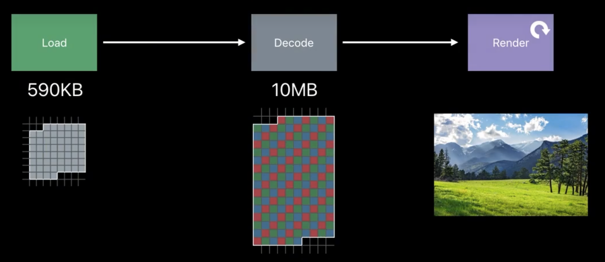

这两天看了WWDC的一些视频，发现在WWDC上可以学到很多知识。记录一下

## 深入了解iOS内存

iOS跟其他的操作系统不一样的是，其他操作系统如果遇到内存不足的情况，会进行`内存交换`，也就是将不用的内存放到硬盘里面,但是iOS不一样，他会直接将其他应用杀死,那么当内存不够用时OS 的处理是会发出内存警告，告知进程去清理自己的内存，代码中的 didReceiveMemoryWarning() 方法就是在内存警告发生时被触发，app 应该去清理一些不必要的内存，来释放一定的空间.

未被使用的内存页是 Clean Page，使用的是Dirty Page，以及一个Compressed Page

- Clean Page:在iOS上指的是重新创建的内存：
- Dirty Page:也就是使用的内存
  - app 的二进制可执行文件
  - framework 中的 _DATA_CONST 段
  - 文件映射的内存
  - 未写入数据的内存
- Compressed memory:内存不够用的时候，将内存进行压缩，当用的时候，再解压回来，也属于 Dirty Memroy
  - 之前是将内存与硬盘进行交换，但是现在呢？这里是在内存中将这些 Page 进行压缩，这样一来，就不需要跟硬盘进行交换，但是 CPU的工作量就会变高，

注意到，当收到内存警告的时候，此时要清理内存了，结果要清理 NSDictionary的一些东西，但是这些刚好是 Compressed memory 的时候，此时一解压，反而使用内存更多了， 所以，进行缓存更推荐使用 NSCache 而不是 NSDictionary，就是因为 NSCache 不仅线程安全，而且对存在 compressed memory 情况下的内存警告也做了优化，可以由系统自动释放内存。

## 工具使用

### Memory Graph

Xcode 中可以将 Memory Graph 导出，导出之后，可以使用 vmmap 和 leaks 进行分析

## 图像

`图像的内存使用大小跟图像的尺寸有关，跟图像的文件大小无关`

图像显示到屏幕上，最终会展示成位图(Bitmap)的，也就是说当前图片大小不是跟图像的文件大小有关，而是跟如下的的尺寸大小有关

```text
内存占用 = 内存占用 ≈ 宽 × 高 × 每像素字节数
```

这里有两个概念，data buffer 和 image buffer

- data buffer:也就是数据，png 或者 jpg 的数据，此时都是字节，不是图像
- image buffer:将 data buffer decode 之后，也就是解压之后，会放到 image buffer里面，image buffer 跟图像的大小是成正比的
- frame buffer: iumage buffer 中的数据到 frame buffer后，渲染到屏幕上



> TODO: 不过这个是常规说法。现在ios支持yuv直接上屏，内存会减少超级多。preparingForDisplay这个接口


## 参考资料

[wwdc18-深入理解 iOS 内存](https://www.bilibili.com/video/BV1tE411f76p/?spm_id_from=333.337.search-card.all.click&vd_source=f1c89669d341702064db968ba68bdc30)

[wwdc2018-图像和图形的最佳做法](https://www.bilibili.com/video/BV18E411f77E/?spm_id_from=333.337.search-card.all.click&vd_source=f1c89669d341702064db968ba68bdc30)