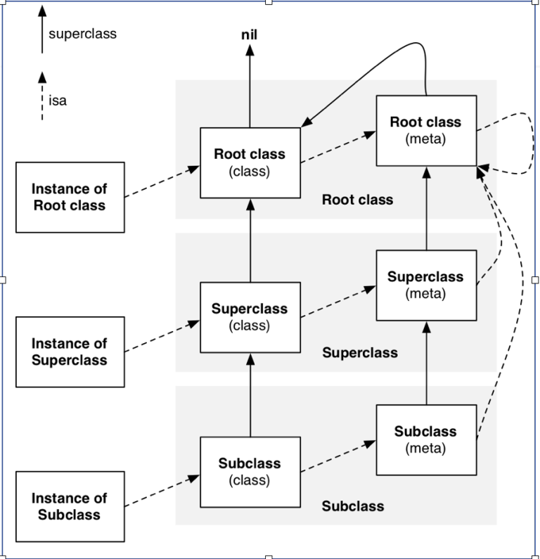
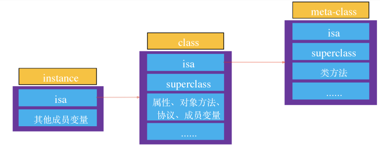

之前学了一下Objective-C的Runtime,发现学的不是那么深刻，所以这里写一篇文章，算是边写边学了。

## 概念

OC中加入了很多新的概念，其中主要好似有instace object和class object和meta object，主要是有以下区别，

- instace object(实例对象)：instance示例对象是通过alloc出来的对象，每次使用alloc都会产生新的instance对象。
- class对象(类对象)：对于每一个类，内存中有且只有一个类对象。
- meta-class(元类对象)：对于每一个类来说，内存中有且只有一个类对象

这里说是对象，其实是因为oc everything is object，所以这里抽象成对象了，如果是C++，那么其实就是类，零成本抽象，其实没有那么多区别

对于上述对象中存储的东西，有以下区别。

- 实例对象（instance object）
  - isa指针：指向的是类对象
  - 对象中的成员变量
- 类对象（class object）
  - isa指针：指向的是元类对象
  - superClass指针：指向的是他的父类，是类对象的父亲，如果到顶了，就是nil
  - 类的属性信息（@property），类的对象方法信息（method '-'开头的方法）,类的协议信息（protocol）和类的成员变量信息（ivar）等。
- 元类（meta object）
  - isa指针
  - superClass指针：指向他的父类，也就是元类对象的父亲，不同的是，如果到顶了，那么这里指向的是基类的class
  - 类的方法信息（也就是+开头的方法）

以下是对象的相关关系

## 消息发送

OC中的调用方法是在Runtime运行期展开的，而不是像C/C++一样在编译期就确定了，所以与C++一样调到某一个地址就可以，大致的消息转发流程如下

1. 先通过isa指针找到对应的类对象，或者是找到对应的meta-class
   1. 如如果是实例对象（instance object）调用，那么就找到对饮的类对象（class object），如果是类方法调用，先找到对应的元对象（meta-class object）
2. 如果当前找到了，那么就直接执行对应的方法就行了
3. 如果没有找到，那么就通过类对象或者实例对象的superClass指针往上找，就是沿着他的父类找，一直往上找
4. 如果最终找不到，那么就会Crash(当然，也会有补救错误)
   1. 这里有一点不同的是，注意到meta-class的superClass指针指向的是基类的类对象，那么这时候还是往基类的类对象找一下，调用一下，如果找不到，就crash。

### 补救方法

待补充
